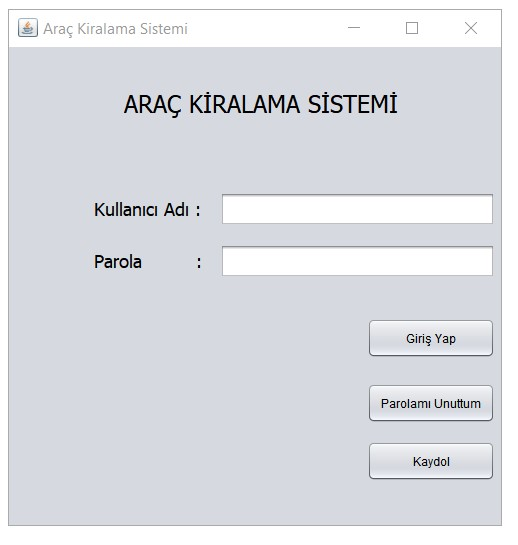
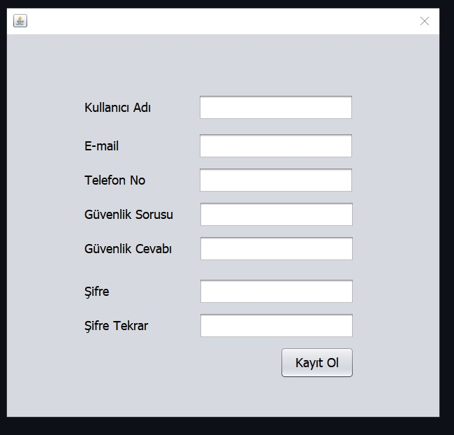
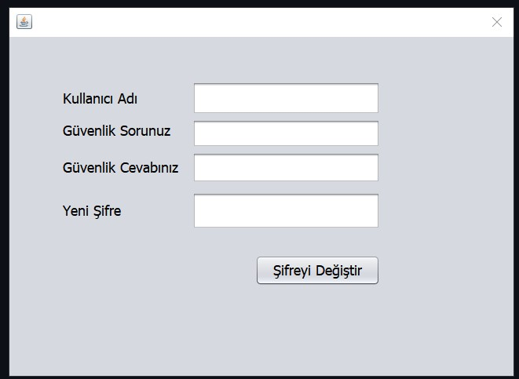
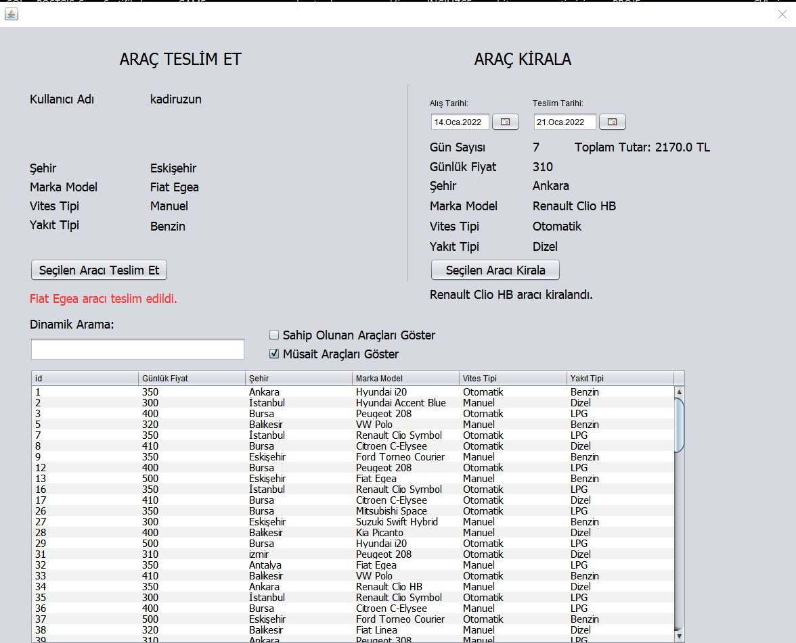
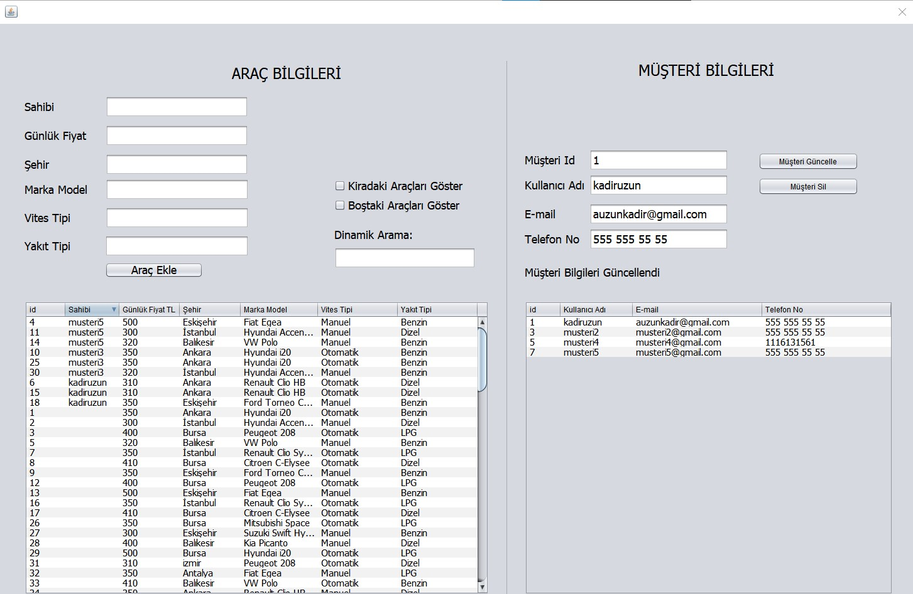
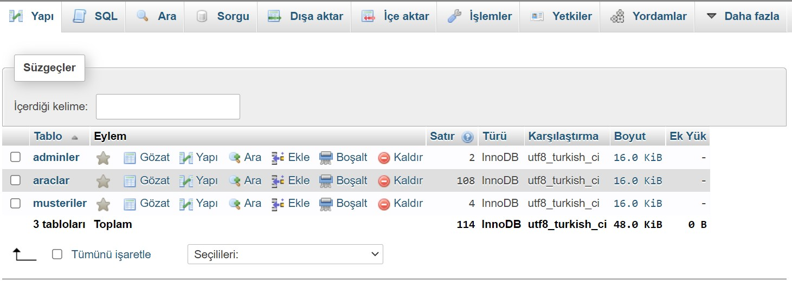
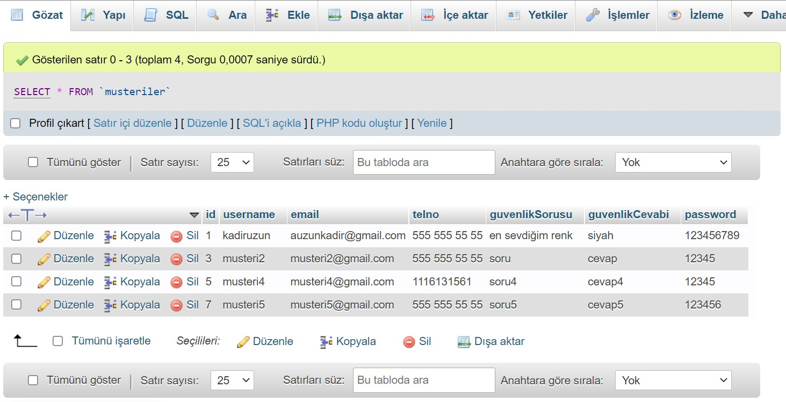
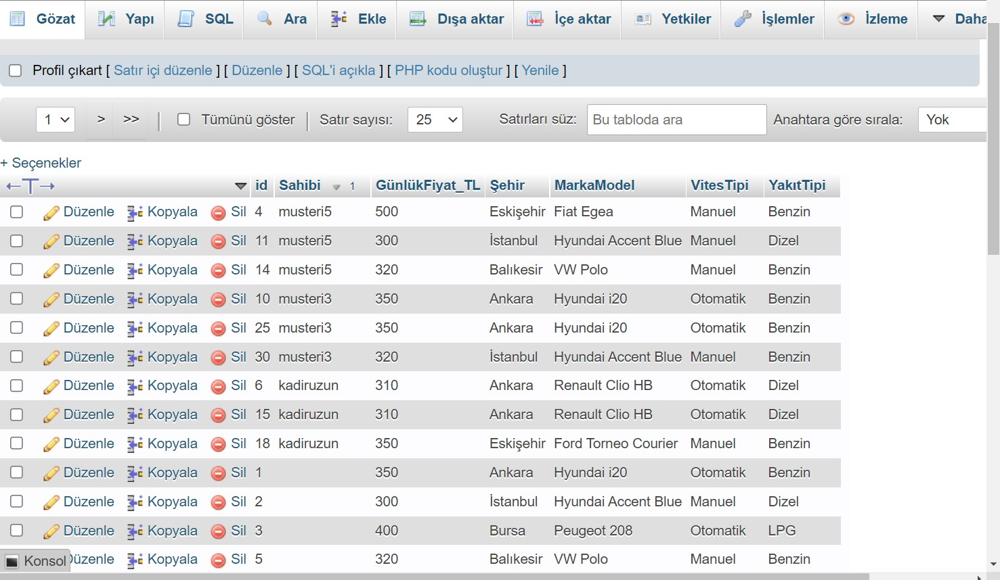

# AracKiralamaSistemi
MySQL veritabanı kullanılarak oluşturulmuş olan Araç Kiralama Sistemi ile müşteriler dinamik arama yapabilirler ve 
veritabanında müsait durumda olan araçları istedikleri tarihler arasında kiralayabilirler. 
Yöneticiler ise kendilerine özel ekranda sistemdeki müşterilerin bilgilerini ve araçların durumlarını izleyebilirler.

Giriş Ekranı:

Kayıt Olma Ekranı:

Şifre Değiştirme Ekranı:

Kullanıcı Ekranı:

Yönetici Ekranı:

Veritabanı tabloları:

Müşteri Tablosu:

Araç Tablosu:

